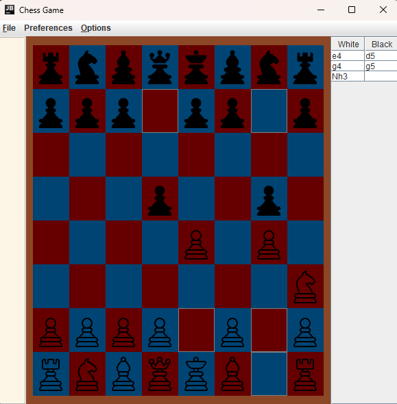

# Chess Game Application

Welcome to the **Chess Game Application**! This project is a fully-featured, Java-based chess game that you can play on
your local machine. Whether you're a beginner or an experienced player, this application offers a fun and challenging
experience.

## Resources
This project was developed following the tutorial series from this YouTube playlist:
[Complete Chess Game in Java](https://youtube.com/playlist?list=PLOJzCFLZdG4zk5d-1_ah2B4kqZSeIlWtt&si=suMZsn140Ro9GWzL)

## Features

### Board Setup
- **A standard 8x8 chessboard with alternating colors and proper initial placement of pieces (pawns, rooks, knights, bishops, queens, kings).**
### Piece Movement: Implement the movement rules for each piece:
- **Pawn: Moves forward but captures diagonally. Can move two squares on the first move.**
- **Rook: Moves horizontally or vertically.**
- **Knight: Moves in an "L" shape (two squares in one direction, one square in a perpendicular direction).**
- **Bishop: Moves diagonally.**
- **Queen: Moves horizontally, vertically, or diagonally.**
- **King: Moves one square in any direction.**
- **Turn-based System: Alternating turns between White and Black players.**
- **Move Validation: Ensure moves are valid based on the rules (no moving through other pieces except for the knight, no moving into check, etc.).**
- **Check/Checkmate Detection: Detect when a king is in check or checkmate.**
- **En Passant: Special pawn capture move when a pawn moves two squares forward.**
- **Pawn Promotion: Allow pawn promotion when reaching the opponent’s back rank (promotion to queen, rook, bishop, or knight).**
- **Castling: Implement castling on both kingside and queenside, ensuring the conditions are met (no pieces between the king and rook, neither piece has moved, etc.).**
## Screenshots



## Getting Started

Follow these instructions to get the chess game up and running on your local machine.

### Prerequisites

- **Java 8 or higher**: Make sure you have the latest version of Java installed.

### Installation

1. **Clone the repository**:
   ```bash
   git clone https://github.com/AndriiSynytsia/ChessGameApp.git

2. **Navigate to the project directory**:
    ```bash
    cd ChessGameApp

3. **Run application** using IDE which you prefer or compile an app using Java compiler:

   Compile the project:
   ```bash
   javac -d bin src/com/javabasicprojects/chessgame/*.java
   ```
   Run the application:
   ```bash
   java -cp bin com.javabasicprojects.chessgame.ChessGame
   ```

### Contributing

Contributions are welcome! If you have ideas to improve the game or want to fix a bug, feel free to fork the repository,
create a branch, and submit a pull request.

### How to Contribute

- **Fork the repository**
- **Create a new branch (git checkout -b feature-name)**
- **Make your changes and commit them (git commit -m 'Add some feature')**
- **Push to the branch (git push origin feature-name)**
- **Open a pull request**

### License

This project is licensed under the MIT License - see the [LICENSE](LICENSE) file for details.